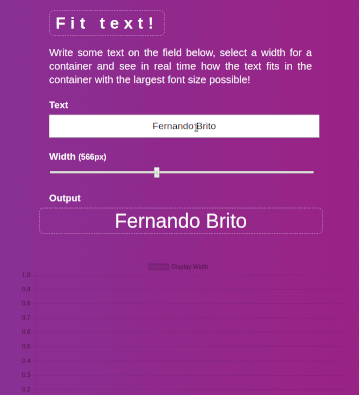

**Do you have questions or suggestions?**
Contact me on [Linkedin](https://www.linkedin.com/in/fernandosmbrito), or open a pull request on this project.

**This project was made as a programming assignment for a job interview.**

---

# Fit Text

[](https://circleci.com/gh/fernandobrito/assignment-fit-text)
[](https://codecov.io/gh/fernandobrito/assignment-fit-text)
[](https://codeclimate.com/github/fernandobrito/assignment-fit-text)
[](https://codeclimate.com/github/fernandobrito/assignment-fit-text)

> You need to create a JavaScript solution to make a variable length text fit inside a container with 
flexible width but fixed height. The purpose of the solution is to “fit” the input text into the 
div in one line (no line breaks) within the div height and using the maximum possible integer font-size​.
The form’s text input and range slider position should be persisted between page reloads. 
Use any framework/tool/library that you consider appropriate. There are no restrictions in that sense.

Built with TypeScript and React.

For this project I have intentionally chosen not to use [Create React App](https://github.com/facebook/create-react-app)
or similar tools in order to practice how to configure from scratch Webpack (and its loaders), TypeScript and integrate all different tools.

I have used a third-party library to do the actual text resizing ([jquery-textfill](https://github.com/jquery-textfill/jquery-textfill))
and I chose to focus on other aspects of the solution, such as project organization, code quality and modularity. 

The project is deployed at: https://fernandobrito.github.io/assignment-fit-text/ (GitHub Pages).

<p align="center"></p>


## Technologies

* [node](https://github.com/nodejs/node) (8.11.2)
* [react](https://facebook.github.io/react) (16.4.0)
* [typescript](https://github.com/Microsoft/TypeScript) (2.8.3)
* [jquery](https://github.com/jquery/jquery) (3.3.1)
* [jquery-textfill](https://github.com/jquery-textfill/jquery-textfill) (0.6.0)
* [js-cookie](https://github.com/js-cookie/js-cookie) (2.2.0)
* [chart.js](https://github.com/chartjs/Chart.js) (2.7.2)
* [react-chartjs-2](https://github.com/jerairrest/react-chartjs-2) (2.7.2)
* [webpack](https://github.com/webpack/webpack) (4.10.0)
* [jest](https://github.com/facebook/jest) (23.1.0)
* [enzyme](https://github.com/airbnb/enzyme) (3.3.0)
* [tslint](https://github.com/palantir/tslint) (5.10.0)
* [sass-lint](https://github.com/sasstools/sass-lint) (1.12.1)


## Services

* [CircleCI](https://circleci.com/gh/fernandobrito/assignment-fit-text): Run tests, lint tools and build project on each commit.
* [CodeCov](https://codecov.io/gh/fernandobrito/assignment-fit-text): Test coverage report (pushed by CircleCI after each build).
* [CodeClimate](https://codeclimate.com/github/fernandobrito/assignment-fit-text/): Code quality analysis.


## Installation

:clipboard: Install all necessary modules to run the current project.

```bash
$ git clone https://github.com/fernandobrito/assignment-fit-text
$ cd assignment-fit-text
$ yarn install
```


## Development

:clipboard: Start development server.

```bash
$ yarn start
```

The app will be served with live reloading and hot module replacement on `http://localhost:8080`.


## Test

The project uses `jest` as a testing solution and `enzyme` for React testing utilities. There is
over 97% test code coverage.

:clipboard: Run all unit tests.

```bash
$ yarn test
```


## Lint

Different linting tools are used to enforce a consistent coding style.

:clipboard: Run linting tools individually.

```bash
$ yarn lint:ts
$ yarn lint:sass
```

:clipboard: Run all linting tools at once.

```bash
$ yarn lint
```


## Build

Webpack is used to generate minified asset bundles.

:clipboard: Build the app for production on the `dist` folder

```bash
$ yarn build
```


## Deploy

:clipboard: Build the app and deploy it to GitHub Pages. 

```bash
$ yarn deploy:gh-pages
```


## Contributing

1. Fork it
2. Create your feature branch with specs (`git checkout -b my-new-feature`)
3. Commit your changes (`git commit -am 'Add some feature'`)
4. Push to the branch (`git push origin my-new-feature`)
5. Create new Pull Request


## Suggestion for improvements

- [ ] Improve build process by moving CSS to its own files and improving chunks generation
- [ ] Improve folder organization. Move test and lint configuration files from project root to subfolder 
- [ ] Use alternative lib for resizing the text that does not depend on jQuery 


## Known issues

* [html-webpack-plugin](https://github.com/jantimon/html-webpack-plugin) has a known issue and will display
`Entrypoint undefined = index.html` on the console output. This message can be ignored ([html-webpack-plugin#895](https://github.com/jantimon/html-webpack-plugin/issues/895)).

## Contributors

* Fernando Brito ([fernandobrito](https://github.com/fernandobrito))


## License

This project is licensed under the MIT License. Check the `LICENSE` file.
